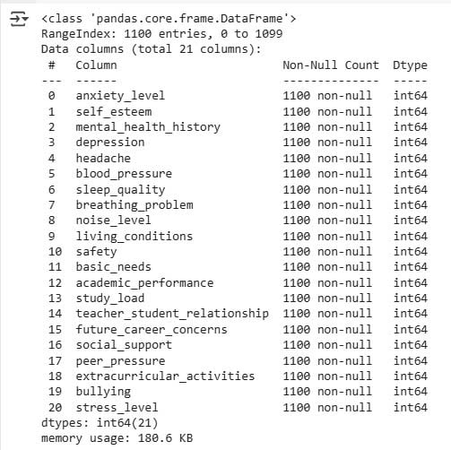
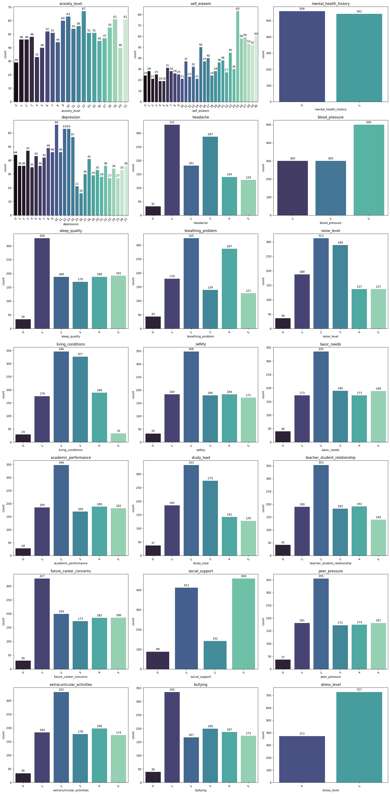
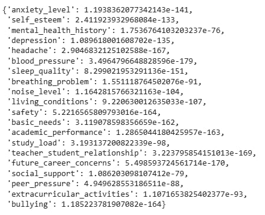
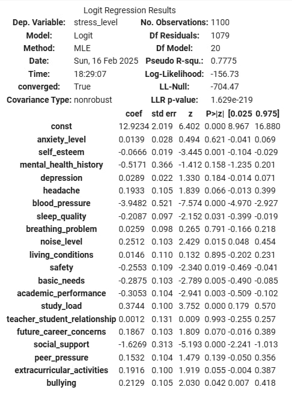
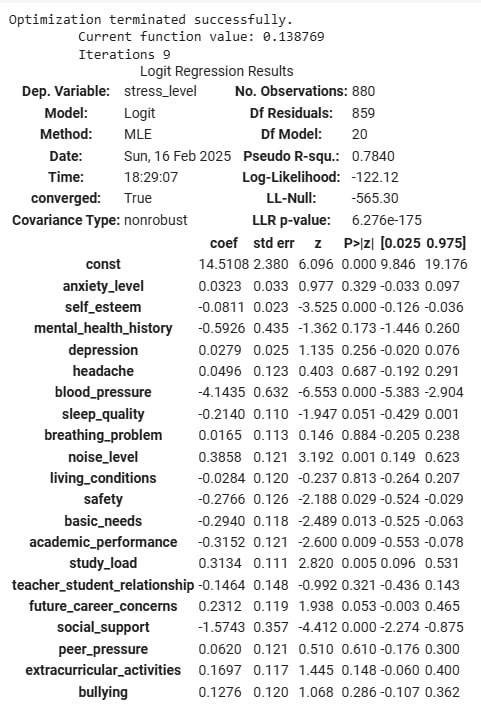
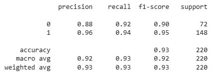
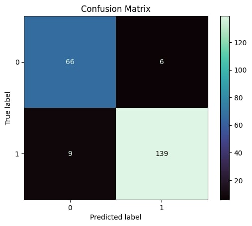
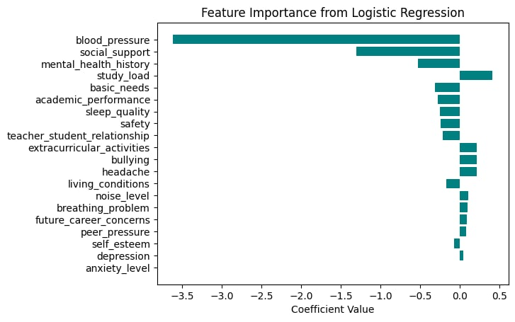
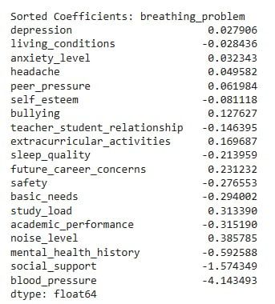

# Analyzing Student Stress Factors for Improved Mental Health Support

## **Introduction**
Student stress is a growing issue in academic institutions, significantly affecting students' mental and physical well-being. This project aims to analyze various psychological, physiological, academic, and social factors contributing to student stress levels, using data analysis and machine learning techniques to identify key stressors and predict stress levels. By understanding these factors, the project seeks to provide valuable insights for improving mental health support and well-being programs in schools and universities, helping educators and health professionals implement effective strategies to manage and reduce stress, ultimately enhancing students' academic and personal experiences.


## **Purpose and Outcome**
- **Purpose:** To identify key factors contributing to student stress and develop actionable strategies for improving mental health support in academic institutions.
- **Outcome:** Create a model that predicts stress levels, helping schools and mental health professionals understand the main reasons students feel stressed. This can guide changes or provide support where it is needed most.

---
## **Data source**
The dataset is obtained from Kaggle: https://www.kaggle.com/datasets/rxnach/student-stress-factors-a-comprehensive-analysis/data 

## **Dataset Information:**
- **Number of Observations (Rows)**: 1,100.
- **Number of Features (Columns)**: 20, grouped into five categories:  
  - **Psychological Factors** → 'anxiety_level', 'self_esteem', 'mental_health_history', 'depression'  
  - **Physiological Factors** → 'headache', 'blood_pressure', 'sleep_quality', 'breathing_problem’  
  - **Environmental Factors** → 'noise_level', 'living_conditions', 'safety', 'basic_needs'  
  - **Academic Factors** → 'academic_performance', 'study_load', 'teacher_student_relationship', 'future_career_concerns'  
  - **Social Factors** → 'social_support', 'peer_pressure', 'extracurricular_activities', 'bullying'

## **Scale Explanation:**
- **‘anxiety_level' (0-21)**: Generalized Anxiety Disorder Scale (GAD-7)
  - 0–4: Minimal anxiety
  - 5–9: Mild anxiety
  - 10–14: Moderate anxiety
  - 15–21: Severe anxiety

- **‘self_esteem' (0-30)**: Rosenberg Self-Esteem Scale
  - 0–14: Low self-esteem
  - 15–24: Moderate self-esteem
  - 25–30: High self-esteem

- **‘depression' (0-27)**: Patient Health Questionnaire (PHQ-9)
  - 0–4: Minimal depression
  - 5–9: Mild depression
  - 10–14: Moderate depression
  - 15–19: Moderately severe depression
  - 20–27: Severe depression

- **mental_health_history (0/1)**: Yes/No

- **‘blood_pressure' (1-3)**:
  - 1: Normal blood pressure
  - 2: Elevated blood pressure (pre-hypertension)
  - 3: High blood pressure (hypertension)

- **The remaining columns (0-5)** can be adjusted depending on which factors:
  - 0: Very Poor
  - 1: Poor
  - 2: Below Average
  - 3: Average
  - 4: Good
  - 5: Very Good

## Tools and techniques applied
### 1. Tools
Google Colabs: using Python to load data, EDA, build a predictive model, and do feature analysis.
### 2. Techniques

In this project, I will use the Logistic Regression Model to predict the stress level (Yes/No) of students and use train_test_split, classification_report, and confusion_matrix to evaluate the model.

---

## **Step 1: Data Download**

Download the dataset from Kaggle using `opendatasets`. This dataset will be used to analyze the stress factors and predict stress levels.
```python
!pip install opendatasets
```

Since I do not want to download the dataset manually, I am using this library to automatically download it by entering the Kaggle API Key:
```python
import opendatasets as od
od.download("https://www.kaggle.com/datasets/rxnach/student-stress-factors-a-comprehensive-analysis?utm_medium=social&utm_campaign=kaggle-dataset-share&utm_source=facebook&fbclid=IwY2xjawIbRtpleHRuA2FlbQIxMQABHRdRNGmQAKlzUZb-JqmCkOyh_hwJ-NBBiiMx_HEVgykntNr09IPuZSJXWQ_aem_L-4C_GcPU3m4ROoQy4Dd9Q")
```

**How to get the Kaggle API Key to download dataset on Kaggle:**

- Go to Your Kaggle Account Settings
- On the page shown in the image, click on your profile icon in the top right corner.
- From the dropdown menu, select "Settings". Scroll Down to the API Section
- In the API section, you’ll find an option to Create New API Token.
- Download kaggle.json:
- After clicking "Create New API Token", a file named kaggle.json will be downloaded to your computer.
- Open kaggle.json for your information and type in username and key.

Then the dataset should be imported to Google Colab Notebook File.

---

## **Step 2: Import Libraries and Process Data**
Libraries used in this project: 
- pandas: Data manipulation and analysis.
- numpy: Numerical operations.
- matplotlib.pyplot: Plotting and data visualization.
- seaborn: Enhanced data visualization.
- statsmodels.api: Statistical modeling and hypothesis testing.
- sklearn.model_selection: Splitting data and cross-validation.
- sklearn.linear_model: Machine learning models (logistic regression, etc.).
- scipy.stats: Statistical functions and tests.
- sklearn.metrics: Model evaluation and performance metrics.

```python
import pandas as pd
import numpy as np
import matplotlib.pyplot as plt
import seaborn as sns
import statsmodels.api as sm
from sklearn.model_selection import train_test_split
from sklearn.linear_model import LogisticRegression
import scipy.stats as stats
from sklearn.metrics import classification_report, confusion_matrix, ConfusionMatrixDisplay
```

Let's take a quick look over 5 first rows of the dataset (In Google Colab Notebook)
```python
df = pd.read_csv("/content/student-stress-factors-a-comprehensive-analysis/StressLevelDataset.csv")
df.head()
```

Let's take a quick look through the data info to see if any missing values
```python
df.info()
```


Luckily, the dataset does not have any missing values, and the data types are suitable so we can skip the handling missing values step.

- The dataset is loaded, and the `stress_level` column is transformed into a binary format for easier classification.

```python
df['stress_level'] = df['stress_level'].map({0:0, 1:1, 2:1})
```
---

## **Step 3: Exploratory Data Analysis (EDA)**

- **Visualize data distributions**: Visualizations like count plots help in understanding how each variable is distributed.
  
- **Analyze correlations**: We check the relationship between the factors (such as anxiety, academic performance, etc.) and stress level using chi-square test.

Let's plot bar charts showing the total counts in each factor in order to see general distribution of the dataset.
```python
import math

# Define number of columns (3 per row) and calculate rows dynamically
num_columns = 3
num_plots = len(df.columns)
num_rows = math.ceil(num_plots / num_columns)  # Calculate required rows

# Adjust figure size dynamically based on the number of rows
plt.figure(figsize=(19, num_rows * 5.5))

for i, column in enumerate(df.columns, 1):
    plt.subplot(num_rows, num_columns, i)  # Organize plots into grid layout (rows x 3 columns)
    ax = sns.countplot(x=column, data=df, palette='mako')

    # Add data labels on top of bars
    for p in ax.patches:
        ax.annotate(
            f'{int(p.get_height())}',  # Convert count to integer
            (p.get_x() + p.get_width() / 2, p.get_height()),  # Position text at the top center of the bar
            ha='center',  # Horizontally align text at center
            va='bottom',  # Position text slightly above the bar
            fontsize=10,
            color='black',
            xytext=(0, 3),  # Offset to avoid overlap with the bar
            textcoords="offset points"
        )

    plt.xticks(rotation=45)  # Rotate x-axis labels for better readability
    plt.title(column)  # Set title for each subplot

plt.tight_layout()  # Optimize layout to prevent overlap
plt.show()
```



### **Insights**

**Psychological Factors:**

*Anxiety Level:*

*   Most responses concentrated in moderate anxiety levels (10-14), which is ~27% of the total


*Self-Esteem:*


*   Most responses concentrated in high self-esteem levels (25-30), which is ~33% of the total.

*Mental Health History:*

*   Individuals with and without mental health history are nearly equally distributed (50/50)

*Depression:*

*   Most responses concentrated in moderate depression levels (10-14), which is ~27% of the total.

**Physiological Factors:**


*Headache:*


*   Many individuals experience headaches - they are mostly at level 1 and 3, which are very mild and modeate level respectively.


*Blood Pressure:*

*   Most students experience high blood pressure (level 2-3), which takes up ~73% of the total.

*Sleep Quality:*

*   The majority report poor sleep quality at level 1.


*Breathing Problem:*

*   Most have breathing problems, especially at mild level (level 2) and severe level (level 4)


**Environmental Factors:**

*Noise Level:*

*  Many report low to moderate levels of noise (level 2-3).

*Living Conditions:*

*  Most report below-average to average living conditions (level 2-3), with few extremes.


*Safety:*

*  Most report fair safety level, especially at level 2.

*Basic Needs:*

*  Most report fair access to basic needs, especially at level 2.


**Academic Factors:**

*Academic Performance:*

*  Majority report below-average academic performance (level 2).

*Study Load:*

*  Many report moderate study loads (level 2-3),

*Teacher-Student Relationship:*

*  The majority report fairly positive relationships (level 2).

*Future Career Concerns:*

*  Many are concerned about their careers, but just a light level (level 1).


**Social Factors:**

*Social Support:*

*  Majority report adequate social support - mostly in level 1 and 3.

*Peer Pressure:*

*  Many report fair peer pressure level (level 2).

*Extracurricular Activities:*

*  Many participate in extracurricular activities, but not overwhelmingly, mostly level 2.

*Bullying:*

*  The majority report a significant number experience bullying at level 1.

**Conclusion:**

The following features are likely to affect the overall stress level significantly:
* **Anxiety Level** – High levels of anxiety can significantly contribute to overall stress.
* **Depression** – Moderate to high levels of depression often correlate with increased stress.
* **Blood Pressure** – Elevated blood pressure is commonly linked to stress, especially in individuals with chronic stress.
* **Sleep Quality** – Poor sleep can exacerbate stress and lead to feelings of fatigue and irritability.
* **Study Load** – A heavy study load, especially if moderate to high, can increase stress.
* **Social Support** – Insufficient social support or inadequate relationships can exacerbate stress levels.
* **Peer Pressure** – Moderate to high peer pressure can cause stress, particularly in academic or social contexts.
* **Bullying** – Experiencing bullying can lead to severe psychological stress and emotional distress.

---

## **Step 4: Perform Chi-Square Test**

- **Chi-Square Test** for independence between each categorical feature and stress level. This test helps assess whether a feature (e.g., anxiety level, self-esteem, etc.) is significantly related to the `stress_level` or not.


Since all of the above variables are categorical, Pearson’s correlation cannot be used to measure the strength and direction of their linear relationship. In this case, the Chi-square test is performed to see if they are significantly related to `stress_level` or not.

```python
# List of categorical variables
categorical_columns = df.drop('stress_level', axis=1)
categorical_variables = categorical_columns.columns

# Store p-values for each variable
p_values = {}

# Loop through each numeric categorical variable and perform the Chi-square test with stress_level
for var in categorical_variables:
    # Create a contingency table for each variable and the binary stress_level
    contingency_table = pd.crosstab(df[var], df['stress_level'])

    # Perform the Chi-square test of independence
    chi2, p_value, dof, expected = stats.chi2_contingency(contingency_table)

    # Store the p-value
    p_values[var] = p_value

# Print the p-values for each variable
p_values
```


**Conclusion**: All features are related to `stress_level`, and all are significantly associated with `stress_level`. --> All of them can be used in logistic regression.

---

## **Step 5: Build Logistic Regression Model**

- **Build Logistic Regression Model** using `statsmodels`.
- The model is evaluated using `classification report` and `confusion matrix` to assess how well it predicts stress levels based on the given factors.

```python
X = df.drop('stress_level', axis=1)
y = df['stress_level']
X = sm.add_constant(X)
model = sm.Logit(y, X).fit()
model.summary()
```



### **Results:**
Pseudo R-squared: $0.7775$

>In this case, a value of 0.78 indicates a reasonably good fit.


LLR p-value: $1.629e-129$

>The p-value is extremely low, indicating that the model can significantly predict the target variable (`stress_level`).

---

## **Step 6: Model Training and Evaluation**

- **Train-Test Split**: Data is split into training and testing sets to evaluate the model on unseen data.
- **Classification Report**: The model’s precision, recall, F1-score, and accuracy are evaluated.
- **Confusion Matrix**: This visualizes the model's performance, showing how many true positives, true negatives, false positives, and false negatives it produced.
- **Feature Importance**: The model's coefficients are examined to determine which features most significantly influence the prediction of stress levels.

Now to simulate prediction on data, we will again divide our data into training and testing data using `train_test_split`.

```python
X_train, X_test, y_train, y_test = train_test_split(X, y, test_size=0.2)
model = sm.Logit(y_train, X_train).fit()
model.summary()
```


The prediction will be performed based on a probability, which threshold = $0.5$
* if  $\text{prediction} > 0.5$ , student is likely to have stress.
* if  $\text{prediction} \leq 0.5$ , student is likely to be stress-free.

### **Classification Report**

```python
#probability
predictions = model.predict(X_test)
threshold = 0.5
y_pred = np.where(predictions > threshold, 1, 0)
#generate the classification report
report = classification_report(y_test, y_pred)
print(report)
```


**Accuracy:** $0.93$

* The model has a high accuracy (93%), which suggests that it correctly classifies a large proportion of instances.

**Precision, Recall, and F1-Score:**

**Class 0 (No Stress):**

* Precision $(0.88)$: The model correctly identifies 88% of the no-stress cases.

* Recall $(0.92)$: The model correctly identifies 92% of actual no-stress cases.

* F1-Score $(0.90)$: A balanced measure that combines precision and recall, showing good performance for class 0.

**Class 1 (Stress):**

* Precision $(0.96)$: The model has a high precision in identifying stress cases (96%).

* Recall $(0.94)$: The model identifies 94% of the actual stress cases.

* F1-Score $(0.95)$: This is a very good score, showing that the model does an excellent job identifying stress instances.

**Macro avg:**
* Over $0.90$ for precision and recall, indicating a good overall performance across both classes.

**Weighted avg:**
* Over $0.90$ for both precision and recall, showing that the model is balanced in its performance on both classes, with a slight bias towards class 1.


### **Confusion Matrix**

```python
cm = confusion_matrix(y_test, y_pred)
# Display the confusion matrix
disp = ConfusionMatrixDisplay(confusion_matrix=cm)
disp.plot(cmap='mako')
plt.title('Confusion Matrix')
plt.show()
```


* True positives $(139)$: Stress instances correctly predicted as stress.
* False positives $(6)$: No-stress instances incorrectly predicted as stress.
* True negatives $(66)$: No-stress instances correctly predicted as no-stress.
* False negatives $(9)$: Stress instances incorrectly predicted as no-stress.
>*Accuracy:* The model does a great job overall, as it makes 66 correct predictions for no stress and 139 correct predictions for stress, with a few mistakes.

> In general, the model is doing a great job at predicting stress levels. Moreover, this suggests that the model is better at identifying stress cases but has some room for improvement in distinguishing no-stress cases (as seen in the false positives).


### **Feature Importance**

- **Extract Feature Coefficients**: The model's coefficients are examined to determine which features most significantly influence the prediction of stress levels.
- Features with higher absolute values in the coefficients are considered **more important**.

```python
 # Get the coefficients (log-odds) of the features
coefficients = model.params

# Exclude the constant term (usually 'const')
coefficients_without_const = coefficients[coefficients.index != 'const']

# Sort the coefficients to get feature importance
sorted_indices = np.argsort(np.abs(coefficients_without_const))[::1]
sorted_coefficients = coefficients_without_const[sorted_indices]
sorted_features = coefficients_without_const.index[sorted_indices]

# Plotting feature importance
plt.barh(sorted_features, sorted_coefficients, color='teal')
plt.xlabel('Coefficient Value')
plt.title('Feature Importance from Logistic Regression')
plt.show()

# Print sorted coefficients
print(f'Sorted Coefficients: {sorted_coefficients}')
```




*Most Important Features:*

>**Blood Pressure, Social Support, and Mental Health History (negative coeff)**

They are among the most important factors in predicting stress levels. The large coefficients indicate that changes in these features significantly affect stress predictions. Because they have negative coefficients, the relationship between them and `stress_level would` be inverse.

>**Study Load, Extracurricular Activities , and Bullying (positive coeff)**

They also appear to have substantial importance, highlighting the role of academic and social stressors in determining stress levels. Because they have positive coefficients, the relationship between them and `stress_level` would be positive.

---

## **Recommendations**

- **Focus on managing anxiety** and **depression**.
- Improve **sleep quality** and address **blood_pressure**.
- Provide **academic support** for students with poor performance and high study load.
- **Strengthen social support networks** can help reduce stress significantly.
- Address **bullying** by organizing workshops or psychological support. 

---

## **Project Files:**
- **`stress_factor.ipynb`**: Jupyter Notebook containing the data analysis, model building, and evaluation or you can access to my Google Colab Notebook: https://colab.research.google.com/drive/1ybgIMuqS-9EyatZXOjEBDfpGt2RgZ5CW?usp=sharing

---

### **Conclusion:**

The logistic regression model successfully predicts `stress_level` based on psychological, physiological, academic, and social factors. By improving areas such as **anxiety management**, **academic support**, and **sleep quality**, stress levels can be significantly reduced. Further model optimization and additional data collection can improve predictions.
